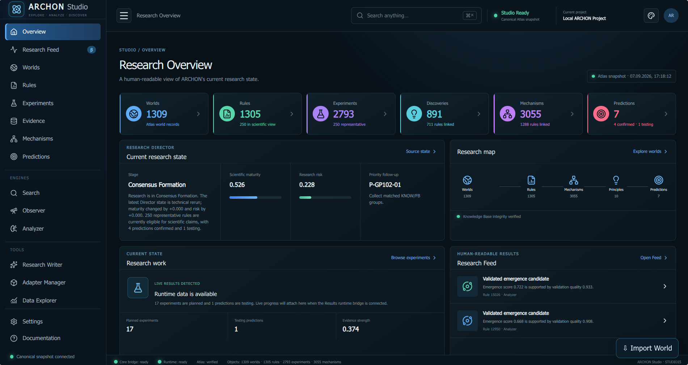
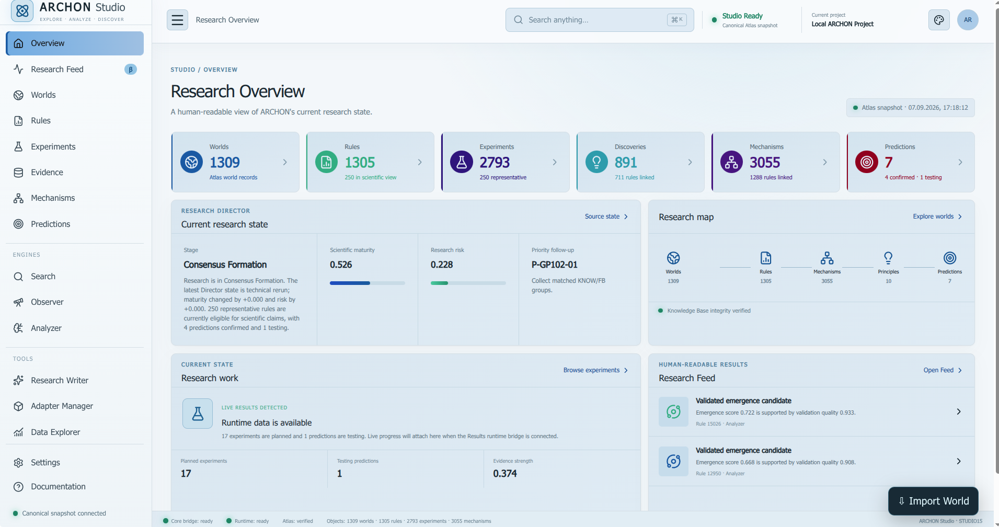
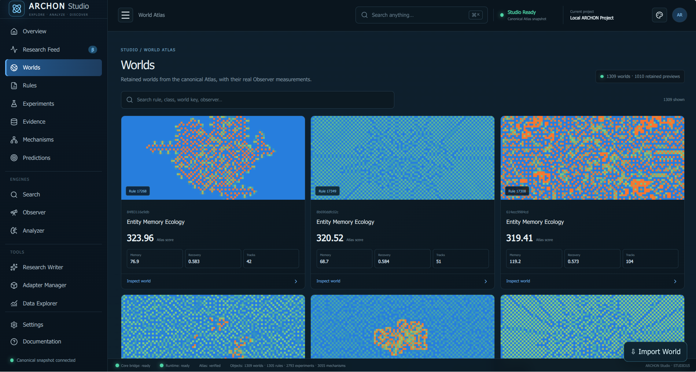
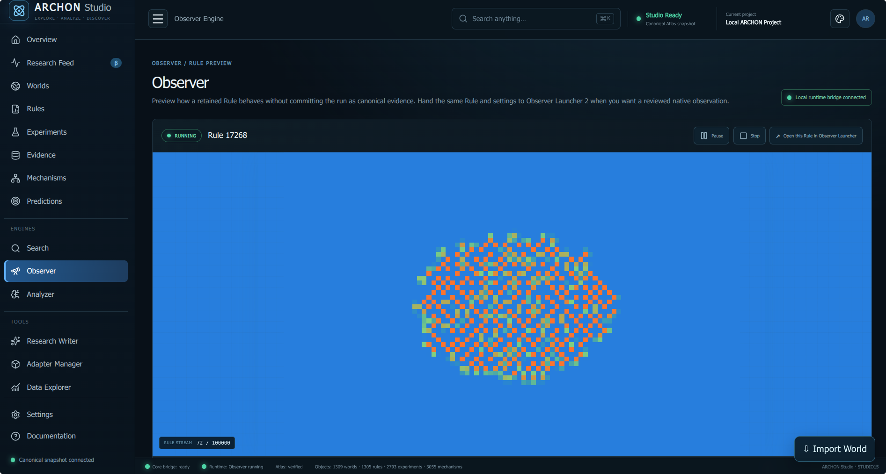
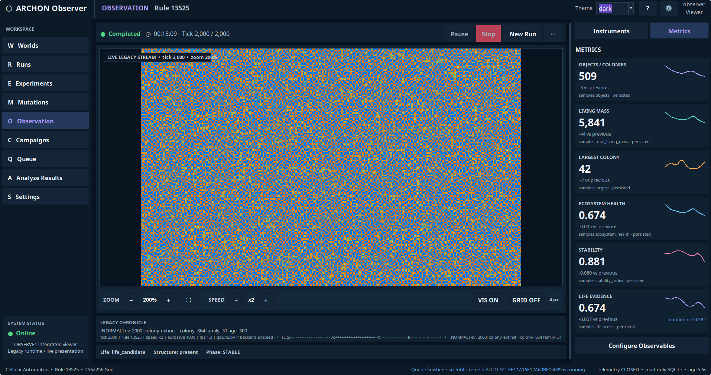
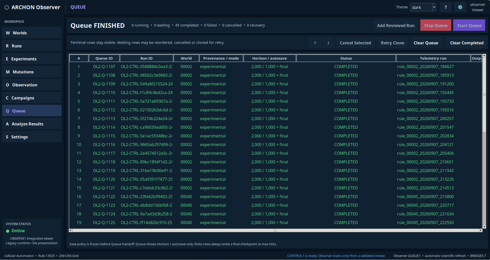
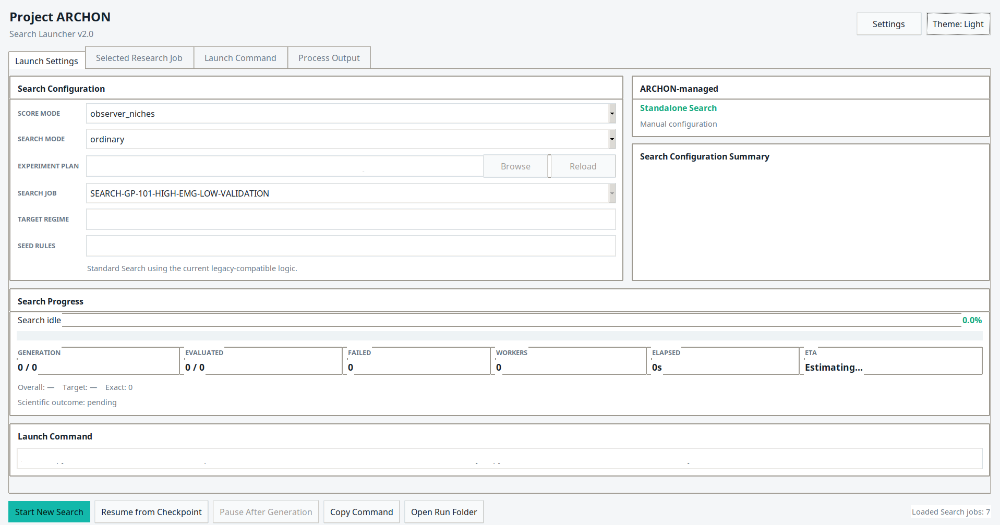

## ARCHON Studio

ARCHON Studio is the main visual workspace for exploring the current research state. It brings together worlds, rules, experiments, evidence, mechanisms, predictions, search tools, and observation workflows in one interface.



The interface includes both dark and light themes.



### Research Feed

Research Feed presents important scientific results in a human-readable form. It highlights validated emergence candidates, discoveries, evidence updates, mechanisms, predictions, and other notable changes produced during research.

### World Atlas

The World Atlas provides a visual catalogue of retained computational worlds. Each entry combines a preview with its rule, Atlas score, and selected measurements, making promising worlds easier to compare and inspect.



### Studio Observer

The integrated Observer provides a quick visual preview of how a retained rule behaves. A rule can be paused, stopped, or handed over to the full Observer Launcher for a reviewed native observation.



## ARCHON Observer

ARCHON Observer is the dedicated environment for running and reviewing computational worlds. It combines live visualization, measurable observables, run controls, experiment management, and result analysis.

### Live Observation

The Observation workspace displays a running or completed world alongside scientific measurements such as object count, living mass, colony size, ecosystem health, stability, and life evidence.



### Experiment Queue

The Queue manages planned, running, and completed observations. It records the associated world, run identifier, provenance, execution settings, telemetry, status, and output location for every reviewed run.



## Universe Search

Universe Search is the launcher for computational exploration. It provides search-mode configuration, research-job selection, progress tracking, checkpoint recovery, worker status, and access to generated run data.


# Project ARCHON

ARCHON is a local scientific-research system for exploring computational
“worlds”: evolving rules generate dynamic fields, promising worlds are retained,
Observer records what happens, and Analyzer turns observations and experiments
into structured evidence, mechanisms, and testable predictions.

The project is designed to keep an explicit research chain:

```text
World → Rule → Experiment → Evidence → Mechanism → Prediction
```

ARCHON studies candidates and competing explanations; a striking visual pattern
is not treated as proof by itself. Canonical records and provenance remain the
source of truth throughout the workflow.

## ARCHON Studio

ARCHON Studio is the main desktop interface included in this release. It is a
local browser, control surface, and reporting layer over the ARCHON engines and
their data. Studio does not replace Universe Search, Observer, or Analyzer; it
starts them, follows their progress, and presents their outputs in a connected,
readable form.

Studio can:

- run and monitor Universe Search;
- preview retained Rules without automatically turning previews into Evidence;
- hand a Rule to Observer Launcher for a reviewed observation;
- run Analyzer and browse its downstream scientific objects;
- inspect Worlds, Rules, Experiments, Evidence, Mechanisms, and Predictions;
- search across objects with `Ctrl+K` on Linux/Windows or `Cmd+K` on macOS;
- export or import individual `.archon-world` packages and complete
  `.archon-worlds` collections;
- create human-readable summaries through Research Writer;
- show runtime paths, available launchers, disk space, and Atlas state in
  **Settings → Runtime Diagnostics**.

## Requirements

This archive is a source/runtime release, not a platform installer. It includes
the production Studio frontend, but it does **not** include a private Python
runtime or a ready-made `.exe`, `.dmg`, or `.AppImage`.

For the complete ARCHON workflow, provide:

- Python 3.12 or newer;
- Python's `sqlite3` and Tk/Tcl (`tkinter`) support;
- NumPy 1.24 or newer;
- an installed web browser; a Chromium-family browser gives the best desktop
  app-window experience;
- a graphical desktop session for interactive interfaces.

Pillow 9.1 or newer is recommended for PNG/GIF previews. CUDA and CuPy are
optional; normal operation uses NumPy on the CPU.

The Studio frontend is already built. Node.js, npm, Vite, and an internet
connection are not needed at runtime.

You can check the Python-side prerequisites with:

```bash
python3 --version
python3 -c "import tkinter, sqlite3, numpy; print('ARCHON prerequisites OK')"
```

If NumPy or Pillow is missing from the selected Python environment:

```bash
python3 -m pip install "numpy>=1.24" "Pillow>=9.1"
```

Tkinter is normally supplied by the Python installer or the operating system,
not by `pip`.

## Install and launch

Keep the extracted tree together: the launchers resolve all paths from the
directory that contains them. The tree must also be writable because ARCHON
creates local configuration, Atlas, Results, and Studio runtime files.

### Linux

Extract the archive into its own directory, enter that directory, and run:

```bash
./ARCHON_STUDIO.sh
```

The release contract supports Linux on `x86_64` and `aarch64`. It expects Bash,
Python 3.12+, NumPy, Tkinter, SQLite, and an X11 or Wayland desktop for GUI use.

To add the current checkout to your application menu:

```bash
./STUDIO_INSTALL_DESKTOP.sh
```

This installs an **ARCHON Studio** menu entry for the current user and current
folder. Move the ARCHON folder first if you intend to keep it elsewhere.

### macOS

Extract the archive into a writable directory, then double-click
`ARCHON_STUDIO.command` or run it from Terminal:

```bash
./ARCHON_STUDIO.command
```

The launcher uses `ARCHON_PYTHON` when set; otherwise it looks for `python3` and
then `python`. Use a Python 3.12+ installation with Tkinter, SQLite, and NumPy.

If macOS removes executable permission during transfer, restore it with:

```bash
chmod +x ARCHON_STUDIO.command
```

### Windows

Extract the archive into a writable user directory. Do not place this source
release under `Program Files`. Double-click `ARCHON_STUDIO.bat`, or run it from
Command Prompt:

```bat
ARCHON_STUDIO.bat
```

The launcher tries the Python Launcher (`py -3`), then `python3`, then `python`.
Install 64-bit Python 3.12+ with Tk/Tcl and SQLite, followed by the required
packages if necessary:

```bat
py -3 -m pip install "numpy>=1.24" "Pillow>=9.1"
```

The archive contains Windows staging and installer source, but no completed
Windows installer. Its own release record marks native Windows acceptance as
not yet executed, so this source-tree route should be treated as available but
not yet natively certified.

## First run

Starting with no Atlas and no retained Worlds is valid. Studio may show
**No research yet**; this does not indicate a broken installation. If the
welcome guide is not shown automatically, it can be reopened from Settings.

A useful first session is:

1. Open **Search** and start Universe Search. Choose ordinary search for the
   simplest beginning. Search evolves and evaluates Rules and retains selected
   Worlds in the Atlas.
2. Open **Worlds** or **Rules** to inspect what was retained.
3. Use **Observer** for a quick Rule preview. Preview output is isolated from
   canonical Evidence. On stop, Studio can save the preview under
   `Results/Studio/saved_previews` or discard it.
4. For a reviewed observation, use **Open this Rule in Observer Launcher**.
   This transfers the Rule and launch settings; it starts a fresh observation
   and does not resume the preview's tick, random state, or grid state.
5. Run **Analyzer** after observations or experiments.
6. Read the resulting **Research Feed**, then follow cards into Evidence,
   Mechanisms, Predictions, or the underlying source object.

Search and analysis may take time. Studio reports live status and owns the
processes it starts; closing the dedicated Studio window shuts down the local
runtime and Studio-owned engines.

## Studio sections

- **Overview** — current research counts, health, progress, and recent
  human-readable highlights.
- **Research Feed** — a filtered stream of retained Worlds, representative
  Experiments, Evidence, Mechanisms, Predictions, and Research Director items.
  Cards use real retained previews where available and link back to canonical
  objects. Filters include Worlds, Experiments, Evidence, Mechanisms,
  Predictions, and Director.
- **Worlds** — the retained World Atlas, including portable World import/export.
- **Rules** — canonical Rule definitions and their links to Worlds, mechanisms,
  and predictions.
- **Experiments** — recorded interventions and controlled runs.
- **Evidence** — validation material, eligibility context, provenance, and links
  back to Rules and Experiments.
- **Mechanisms** — explanatory candidates connected to supporting or testing
  records.
- **Predictions** — testable claims, expected observations, success criteria,
  and validation history.
- **Search / Observer / Analyzer** — embedded controls for the three canonical
  engines. Native launchers remain available where the platform supports them.
- **Research Writer** — summaries, object reports, activity digests, and Research
  Director briefings generated from the current canonical snapshot.
- **Adapter Manager** — local registrations for external engines. In this
  release, adapter entrypoints are metadata only: “connected” does not mean the
  adapter is executable from Studio.
- **Data Explorer** — lower-level inspection of normalized research data.
- **Settings** — local preferences, World-library transfer, runtime diagnostics,
  and onboarding/help controls.
- **Documentation** — the operator guide built into Studio.

## Files and data

At a high level, the release tree is organized as follows:

```text
Universe_Search/       search and world-generation engine
Observer/              observation and evidence collection
Analyzer_next/         analysis, experiments, mechanisms, and predictions
Scientific_Ontology/   shared scientific state vocabulary
World_Portability/     offline World package validation and transfer
Tools/                 Studio runtime, launch integration, and release tools
archon-studio/dist/    prebuilt production Studio frontend
Config/                local launcher and Studio preferences
Atlas/Worlds/          retained canonical Worlds and Rules (created as needed)
Atlas/Knowledge/       canonical knowledge state (created as needed)
Results/Universe_Search/ search, observation, and telemetry output
Results/Analysis/      analysis, experiment, evidence, and report output
Results/Studio/        previews, runtime state, and Studio reports
```

The main path defaults are defined in `archon_paths.py`. Advanced deployments
can redirect search results, analysis results, World Atlas, and Knowledge Atlas
with `ARCHON_RESULTS_DIR`, `ARCHON_ANALYSIS_DIR`,
`ARCHON_WORLD_ATLAS_DIR`, and `ARCHON_KNOWLEDGE_ATLAS_DIR`.

Studio-generated settings, adapter registrations, logs, previews, and caches are
local operator state. They are not silently promoted into scientific Evidence.

Portable World files are deliberately narrower than a full backup:

- `.archon-world` contains one canonical Rule, stable World identity, selected
  Atlas metadata, optional preview, provenance, and checksums;
- `.archon-worlds` contains a collection of independently verifiable Worlds;
- neither format contains Results trees, caches, executables, settings, logs,
  process IDs, or machine-specific paths.

## Privacy and local operation

The supplied runtime is local-first:

- Studio listens on `127.0.0.1` only (port 8765 by default);
- the runtime contract requires no internet connection;
- scientific data, settings, previews, and telemetry remain in the local tree
  or in explicitly configured local paths;
- folder-opening requests from Studio are limited to the ARCHON root, Results,
  Atlas, and Config directories;
- World import validates package structure, hashes, and identity before changing
  the Atlas, and collection import is atomic.

`127.0.0.1` still uses a local HTTP connection between the browser and the
Python runtime. Do not expose that port through a proxy or change the host to a
network-facing address unless you have reviewed the runtime for that use.

## Troubleshooting

### Studio reports that Python 3 cannot be found

Install Python 3.12 or newer and make it available as `python3` on Linux,
`python3`/`python` on macOS, or through `py -3`/`python` on Windows. On macOS you
can also set `ARCHON_PYTHON`; packaged runtimes use `ARCHON_RUNTIME_PYTHON`.

### `ModuleNotFoundError: numpy`

Install NumPy into the same interpreter used by the launcher:

```bash
python3 -m pip install "numpy>=1.24"
```

### `ModuleNotFoundError: tkinter` or no GUI opens

Install a Python build with Tk/Tcl support. On Linux this is commonly a separate
operating-system package such as `python3-tk`. Also make sure an X11 or Wayland
session is available.

### Studio opens in a normal browser

That is the supported fallback when Chrome, Chromium, Edge, or Brave cannot be
opened in app mode. A small Tk window remains responsible for opening or
stopping Studio. Keep it open while using Studio.

### Runtime bridge offline

Start Studio through the platform launcher, not by opening
`archon-studio/dist/index.html` directly. The launcher builds the live snapshot
and starts the local bridge used by the interface.

### No Worlds, Feed cards, or Knowledge Base

An empty research state is valid. Start Universe Search and allow it to retain
the first Worlds. Run Observer and Analyzer before expecting downstream
Evidence, Mechanisms, or Predictions.

### The production frontend is missing, stale, or fails integrity checks

This release has no frontend source package or rebuild script. Re-extract a
clean copy of the release so that `archon-studio/dist/` and its
`archon-studio-build.json` seal are restored together.

### Port 8765 is busy

With no explicit port, the desktop launcher selects an available local port when
8765 belongs to another service. If an older ARCHON Studio session is still
running, close it and launch again. Studio does not kill unrelated processes.

### A launcher is not executable after extraction

On Linux or macOS, restore the shipped executable bits:

```bash
chmod +x ARCHON_STUDIO.sh ARCHON_STUDIO.command STUDIO.sh \
  STUDIO_INSTALL_DESKTOP.sh ANALYZER.sh OBSERVER.sh "UNIVERSE SEARCH.sh"
```

## Source and development notes

This release identifies Studio as **STUDIO20.5**. The scientific engines and
local runtime are supplied as Python source. The Studio UI is supplied only as a
sealed production bundle in `archon-studio/dist/`; this archive has no frontend
source tree, `package.json`, or npm lockfile. Consequently, `npm install` and
frontend rebuild commands are not part of this release's setup.

`ARCHON_STUDIO.sh`, `ARCHON_STUDIO.command`, and `ARCHON_STUDIO.bat` all route to
the same canonical entrypoint: `Tools/archon_studio_desktop.py`. `STUDIO.sh` is
currently an alias for the Linux/macOS desktop launcher.

Two useful read-only launcher checks are included:

```bash
python3 Tools/archon_studio_desktop.py --root . --self-test
python3 Tools/archon_studio_desktop.py --root . --headless-smoke --quiet
```

The second command starts a temporary loopback server, verifies the sealed UI
and health endpoint, and then shuts it down without opening a window.

Platform packaging scaffolding lives under `Packaging/`, with a shared staging
builder in `Tools/archon_distribution_stage.py`. It is intended for release
engineering with a complete redistributable Python runtime; it is not required
to run this source release.
For more operational detail, see `Docs/ARCHON_STUDIO_GUIDE.md` and
`Docs/WORLD1_PORTABLE_WORLDS.md`, while treating the actual shipped launchers and
runtime contracts as authoritative when older notes differ

Project ARCHON's first-party materials are available under the GNU Affero
General Public License, version 3 only (`AGPL-3.0-only`). See `LICENSE` for the
complete controlling text and `Documentation/LICENSE.md` for the project-wide
scope notice. Third-party components retain their respective licenses as listed

Copyright © 2026 Sergii Derebchynskyi.

Licensed under the GNU Affero General Public License,
version 3 only (AGPL-3.0-only).
in `Documentation/THIRD_PARTY_NOTICES.md`. Commercial licensing is described in
`Documentation/COMMERCIAL_LICENSE.md`.

.
